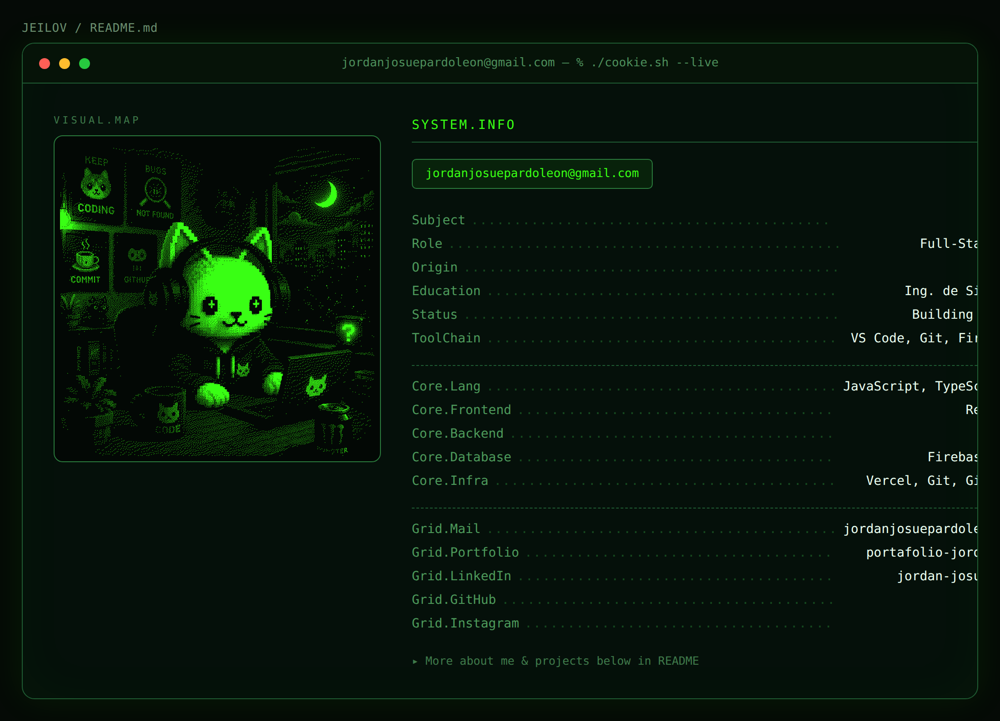

  

---

### 🚀 Sobre mí

- 💻 Desarrollo aplicaciones full stack con **React, Firebase/Firestore, Tailwind y Vite**
- 🏭 Actualmente perfeccionando **Sistema CEIA**, una app de gestión de producción para una planta agroindustrial universitaria
- 🌎 Colaboro con **Munay Perú**, una ONG peruana, desarrollando su plataforma web
- 📚 Combino desarrollo práctico con proyectos académicos (informes, sustentaciones, modelos)

---

### 🧠 Tech Stack

  

---

### 📊 GitHub Stats

  
  

  

---

### 🐍 Actividad

  

---

### 📌 Proyectos destacados

| Proyecto | Descripción | Stack |
|---|---|---|
| 🏭 [**sistema-ceia**](https://github.com/JEILOV/sistema-ceia) | Gestión de producción para planta agroindustrial universitaria, con roles y trazabilidad de lotes | React, Firebase |
| 🛒 [**TuCampus**](https://github.com/JEILOV/TuCampus.) | Marketplace universitario para comprar y vender entre estudiantes | React, Firebase |
| 🤝 [**munay-peru**](https://github.com/JEILOV/munay-peru) | Plataforma web para una ONG de voluntariado | React, Vite, Tailwind |
| 🎨 [**portafolio-jordi**](https://github.com/JEILOV/portafolio-jordi) | Mi portafolio personal con mascota propia (Cookie) | Next.js, Sanity CMS |
| 🍕 [**pizza-inventario**](https://github.com/JEILOV/pizza-inventario) | Sistema de inventario y logística para una pizzería | React, Next.js, Firebase |

---

### 🌐 Conecta conmigo

  
  
  
  

